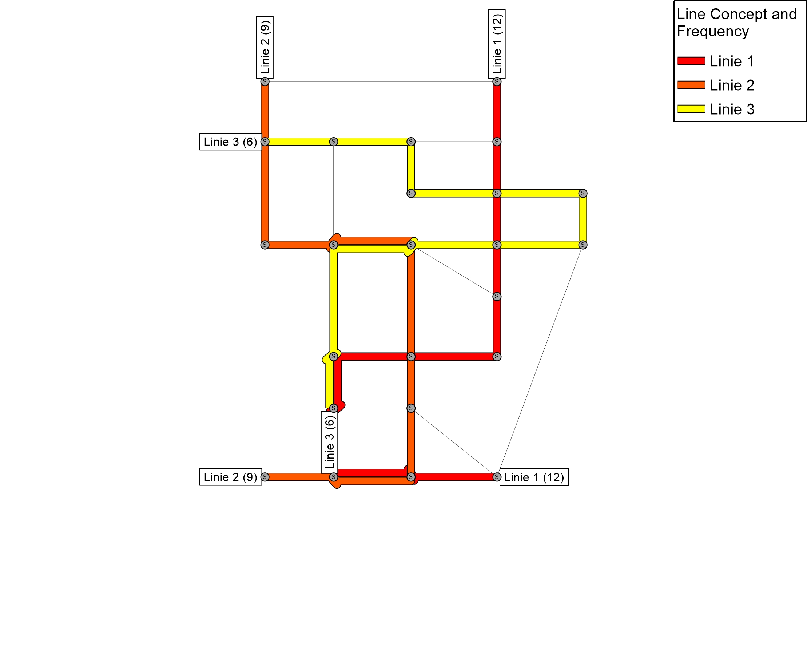

# Results

## Line Concept

## Indicators of a Solution
The independent characteristics of a solution are described and listed for the solution by the following indicators:

| Characteristics of the Solution						| Description																																	| Value	| Unit 	| Time 	| Category	|
| --- 													| --- 																																			| ---	| ---	| ---	| ---		|
| LINES													| number of lines																																| 3	| [-]	| 0700	| supply	|
| VEHICLES												| number of vehicles																															| 47	| [-]	| 0700	| supply	|
| SERVICES (RUNS)										| number of services (runs)																														| 979	| [-]	| 0700	| supply	|
| VEHICLE KILOMETERS TOTAL								| sum of service and empty kilometers																											| 862.80	| [km]	| 0700	| supply	|
| VEHICLE KILOMETERS SERVICE							| sum of kilometers travelled for the transport of passengers																					| 862.80	| [km]	| 0700	| supply	|
| VEHICLE KILOMETERS EMPTY								| sum of kilometres travelled without passengers for pulling out from the depot, pulling in to the depot and interlining between two lines		| 0.00	| [km]	| 0700	| supply	|
| VEHICLE HOURS TOTAL									| sum of service and empty hours																												| 43.50	| [h]	| 0700	| supply	|
| VEHICLE HOURS SERVICE									| sum of hours required for the transport of passengers																							| 43.50	| [h]	| 0700	| supply	|
| VEHICLE HOURS EMPTY									| sum of hours required for pulling out, pulling in, interlining and standing at the terminal													| 0.00	| [h]	| 0700	| supply	|
| OPERATING COST TOTAL									| sum of time and kilometer costs																												| 3644.20	| [$]	| 0700	| supply	|
| OPERATING COST TIME									| sum of costs for personell depending on working time																							| 2350.00	| [$]	| 0700	| supply	|
| OPERATING COST KILOMETER								| sum of costs for fuel, repair, etc. depending on kilometric performance																		| 1294.20	| [$]	| 0700	| supply	|

The assignment dependent characteristics of a solution are described by the following indicators:

| Characteristics of the Solution						| Description																																	| Value	| Unit 	| Time 	| Category	|
| --- 													| --- 																																			| ---	| ---	| ---	| ---		|
| MPJT - SHORTEST PATH 									| mean perceived journey time - shortest path, capacity constraints are not considered 															| 19.35	| [min]	| 0700	| demand	|
| MPJT - MULTIPATH WITHOUT CAPACITY RESTRICTIONS		| mean perceived journey time - multipath, capacity constraints are not considered, distribution in 1 minute time intervalls 					| 19.80	| [min]	| 0700	| demand	|
| MPJT - MULTIPATH WITHOUT CAPACITY RESTRICTIONS		| mean perceived journey time - multipath, capacity constraints are considered, distribution in 10 minute time intervalls						| 19.72	| [min]	| 0700	| demand	|
| MPJT - MULTIPATH WITHOUT CAPACITY RESTRICTIONS		| mean perceived journey time - multipath, capacity constraints are considered, distribution in 1 minute time intervalls						| 19.87	| [min]	| 0700	| demand	|

The final evaluation of a solution uses the indicators mean perceived journey time to describe the impact on the travelers and operating cost to describe the impact on the operator.

## Calculation of Indicators
The perceived journey time depends on the route choice of the travelers. The solutions provide indicators for three different assumption on route choice behaviour. 
1.	Travelers choose the shortest route using the perceived journey time as impedance. Capacity constraints are not considered.
2.	Travelers choose from a set of routes based on a perceived utility (logit model). 
2.1	Capacity constraints are not considered. The desired departure time distribution in 1 minute intervalls (VISUM17_PuTAssignment_CapacityRestrictionNo_LineBlockingInterliningYes_v01.00.xml)
2.2	Capacity constraints are considered. The desired departure time distribution in 10 minute intervalls (VISUM17_PuTAssignment_CapacityRestrictionYes_TI_10min_v01.00.xml)
2.3	Capacity constraints are considered. The desired departure time distribution in 1 minute intervalls (VISUM17_PuTAssignment_CapacityRestrictionYes_TI_01min_v01.00.xml)

## Format
The  results are provided in the following formats:
-	Folder Image:	images from the instance solution (line concept and frequency, link saturation, maximum vehicle journey saturation)
-	Folder LimTim:  text-format 
-	Folder Spreadsheet: .xls Format
-	Folder VISUM:  text-format and binary-format (version file)
