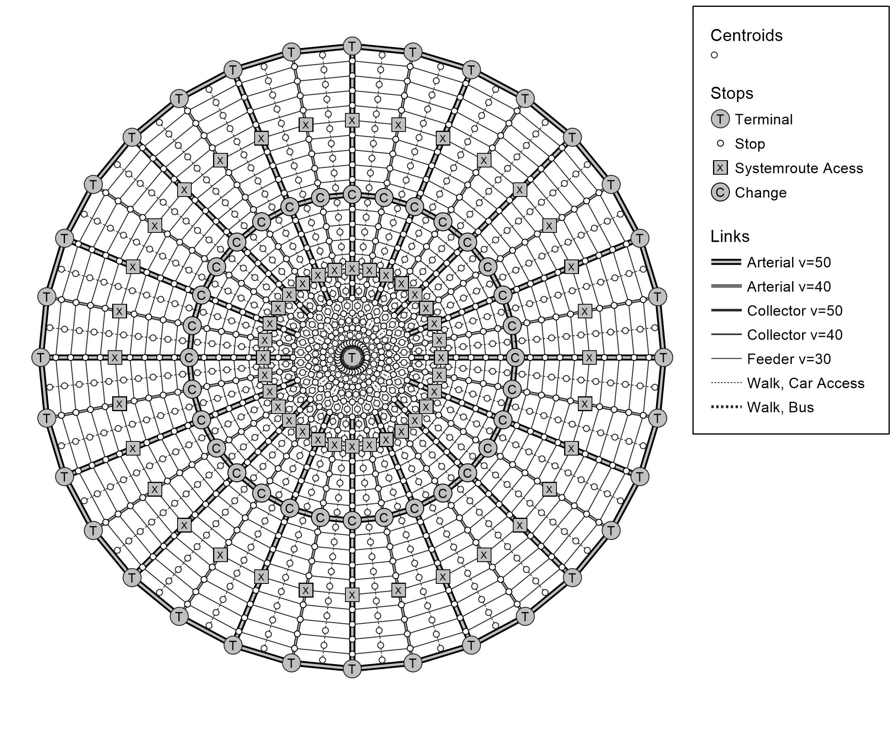
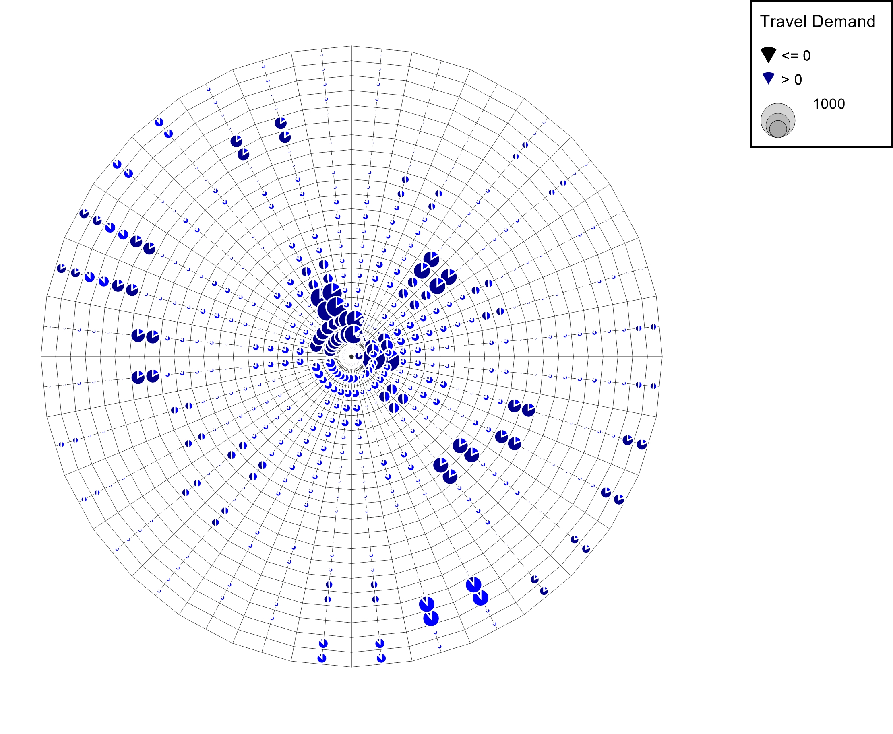
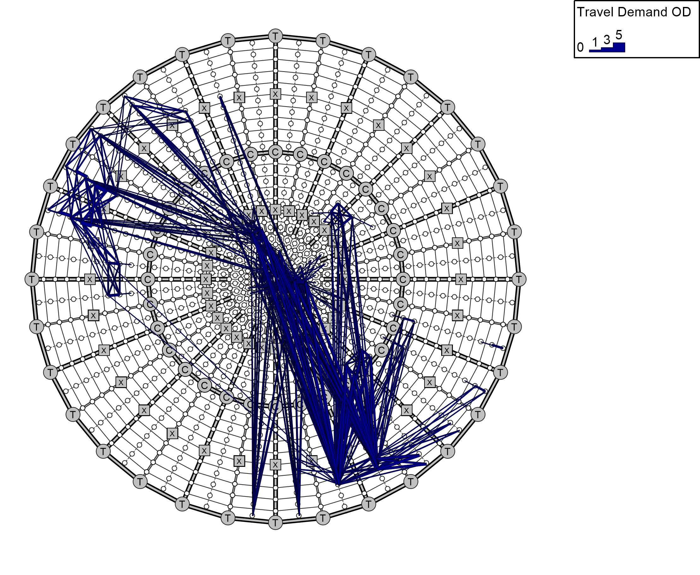

# Ring 16x22 Instance

## Description
A ring network with 22 rings and 16 radial axes.

## Supply Data
| Network       | Value  | Unit |
| ---           | ---    |---   |
| Zones         |    672 | [-]  |    
| Nodes		    |   2689 | [-]  |   
| Stops			|	 673 | [-]  |
| Links         |   6720 | [-]  |

## Demand Data
| Demand       | Value  | Unit       | 
| ---          | ---    |---         |
| OD-pairs     | 450912 | [-]        |
| Trips        |   3957 | [Trips/h]  |

Attention: only the first 500 greatest values for odpairs are displayed.

## Vehicle and Operating Cost Data
One vehicle type with a capacity of 70 places is available. The costs for one vehicle including the driver amount to 50 €/h and 1.50 €/km. Different to interlining trips, pull-out and pull-in trips from and to the depot are not considered. The minimum layover times at the terminals amount to 180 seconds.

| Vehicle           | Value  | Unit     | 
| ---               | ---    |---       |
| Capacity          |     70 |  [Places]|
| Operating Cost/h  |  50.00 |[Monetary]|
| Operating Cost/km |   1.50 |[Monetary]|

## Transfer Time
Every transfer requires a minimum transfer time of 3 minutes.

| Transfer           | Value  | Unit     | 
| ---                | ---    |---       |
| Min. transfer time |      3 |[min]     |

## Perceived Journey Time
Evaluating the service quality considers in-vehicle time IVT, transfer wait time TWT, walk time WT and number of transfers NoT. Every transfer is weighted with a time penalty of 5 minutes. Access and egress times are not included. For the route choice in the assignment and for evaluating the service quality a perceived journey time is computed.

PJT = 1.0 * IVT + 1.0 * TWT + 1.5 * WT + 5.0 * NoT. 

| Factor            | Value  | Unit         | 
| ---               | ---    |---           |
| in-vehicle time   |    1.0 |  [-]         |
| transfer wait time|    1.0 |  [-]         |
| walk time         |    1.5 |  [-]         |
| transfer          |    5.0 |[min/transfer]|
