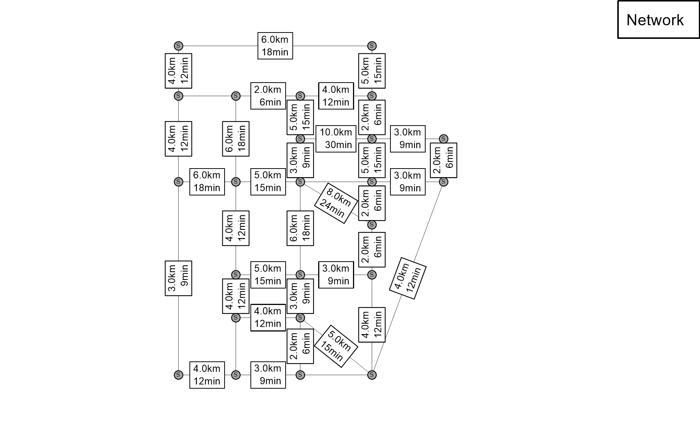
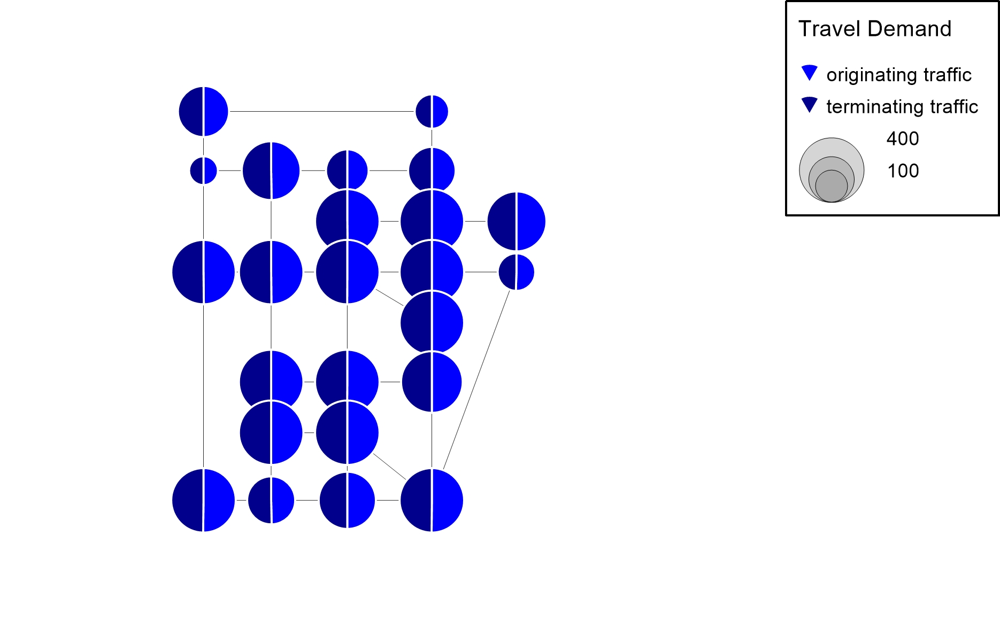
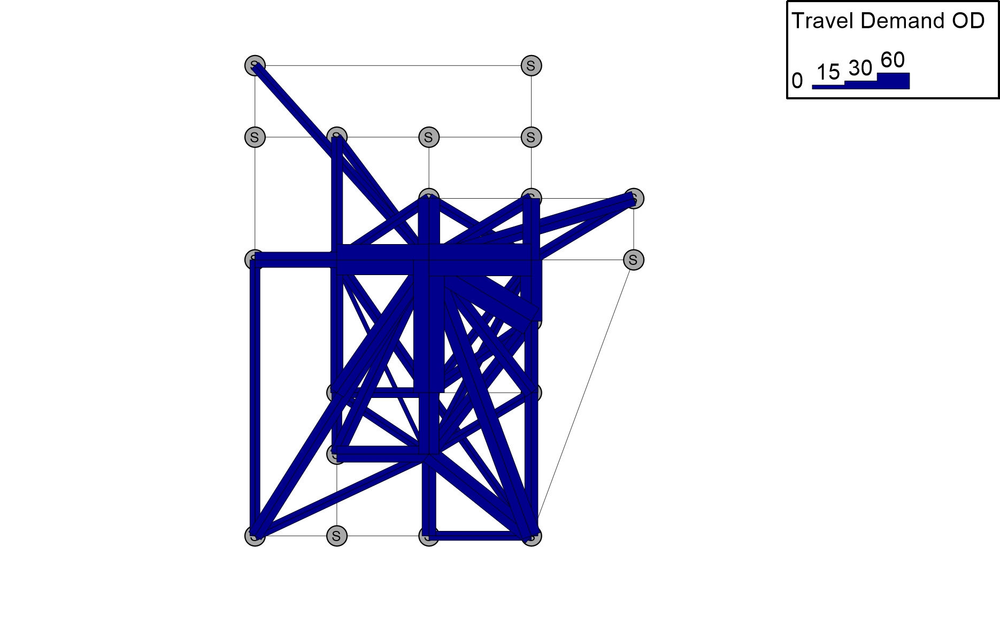

# Sioux Falls

## Description
The Sioux Falls network is used in many publications for testing. It is not considered to be a realistic model. 

For additional information about the history and usage in scientific research please have a look:
https://github.com/bstabler/TransportationNetworks/tree/master/SiouxFalls
http://www.bgu.ac.il/%7Ebargera/tntp/
http://www.bgu.ac.il/~bargera/tntp/SiouxFalls_CNDP/SiouxFallsVariantsForNetworkDesign.html

## Supply Data
| Network       | Value   | Unit |
| ---           | ---     |---   |
| Zones         |      24 | [-]  |    
| Nodes/stops   |      24 | [-]  |   
| Links         |      76 | [-]  |

## Demand Data
| Demand       | Value     | Unit       | 
| ---          | ---       |---         |
| OD-pairs     |      576  | [-]        |
| Trips        |     5151* | [Trips/h]  |

* The original trips are provided [here](https://github.com/bstabler/TransportationNetworks/tree/master/SiouxFalls). The the number of trips are customize to fit hourly loads according to:
Trips_Cust = 0.1 * Trips / 7

Attention: only the first 100 greatest values for odpairs are displayed.

## Vehicle and Operating Cost Data
One vehicle type with a capacity of 70 places is available. The costs for one vehicle including the driver amount to 50 $/h and 1.50 $/km. Different to interlining trips, pull-out and pull-in trips from and to the depot are not considered. There are no minimum layover times at the terminals.

| Vehicle           | Value  | Unit     | 
| ---               | ---    |---       |
| Capacity          |     70 |  [Places]|
| Operating Cost/h  |  50.00 |[Monetary]|
| Operating Cost/km |   1.50 |[Monetary]|

## Transfer Time
Every transfer requires a minimum transfer time of 3 minutes.

| Transfer           | Value  | Unit     | 
| ---                | ---    |---       |
| Min. transfer time |      3 |[min]     |

## Perceived Journey Time
Evaluating the service quality considers in-vehicle time IVT, transfer wait time TWT and number of transfers NoT. Every transfer is weighted with a time penalty of 5 minutes. Access and egress times are not included. For the route choice in the assignment and for evaluating the service quality a perceived journey time is computed

PJT = 1.0 * IVT + 1.0 * TWT + 5.0 * NoT. 

| Factor            | Value  | Unit         | 
| ---               | ---    |---           |
| in-vehicle time   |    1.0 |  [-]         |
| transfer wait time|    1.0 |  [-]         |
| transfer          |    5.0 |[min/transfer]|
